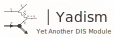

<p align="center">
  <a href="https://n3pdf.github.io/yadism/"></a>
</p>

<p align="center">
  <a href="https://github.com/N3PDF/yadism/actions?query=workflow%3A%22yadism%22"></a>
  <a href="https://codecov.io/gh/N3PDF/yadism"></a>
  <a href="https://www.codefactor.io/repository/github/n3pdf/yadism"></a>
  <a href="https://n3pdf.github.io/yadism/"></a>
  <a href="https://zenodo.org/badge/latestdoi/219968694"></a>
</p>

<!--Future Badges
/github/workflow/status/N3PDF/dis/yadism

use the ones provided by shields.io:
- example: https://img.shields.io/github/workflow/status/N3PDF/dis/yadism

note: in order to make shields.io the repo must be public (or accessible to it in some way)

wanted:
- Workflows (github):
  - yadism-tests: /github/workflow/status/N3PDF/dis/yadism
  - docs: /github/workflow/status/N3PDF/dis/docs
- Test coverage:
  - codecov: /codecov/c/:vcsName/:user/:repo?token=abc123def456
- Python version/s:
  - pypi: /pypi/pyversions/:packageName
  - github: /github/pipenv/locked/python-version/:user/:repo
- Package version
  - pypi: /pypi/v/:packageName
  - github: /github/v/release/:user/:repo?sort=semver
- Dependency on 'eko':
  - /librariesio/github/:user/:repo
  - or anything else

optional:
- Release-date (github):
  - /github/release-date/:user/:repo
- Last-commit (github):
  - /github/last-commit/:user/:repo
- Downloads:
  - github: /github/downloads/:user/:repo/total
  - pypi: /pypi/:period/:packageName
License:
  - pypi-license: /pypi/l/:packageName
  - github-license: /github/license/:user/:repo
- Activity:
  - open-issues (github): /github/issues/:user/:repo
  - open-pull-requests (github): /github/issues-pr/:user/:repo
- Code size:
  - github: /github/languages/code-size/:user/:repo
-->

## Scope of the project
Provide all necessary tools to compute the DIS structure functions and related object. This project is linked closely to [EKO](https://github.com/N3PDF/eko).

## Installation
```
python setup.py install
```

## Documentation
The documentation style of this code follows closely the [numpy documentation
guide](https://numpydoc.readthedocs.io/en/latest/format.html).

Docs available at: https://n3pdf.github.io/dis/

## Development
Members of the development team should always follow the [contribution
guidelines](.github/contributing.md), to have a uniform strategy in code
development and improve collaboration.

## Contributing or contacting the authors
For any kind of interaction consider before to read [external contribution
guidelines](.github/contributing.md#external-contributions), otherwise just send
an email to the authors:
- [Felix Hekhorn](mailto:felix.hekhorn@mi.infn.it)
- [Stefano Carrazza](mailto:stefano.carrazza@cern.ch)
- [Alessandro Candido](mailto:alessandro.candido@mi.infn.it)
